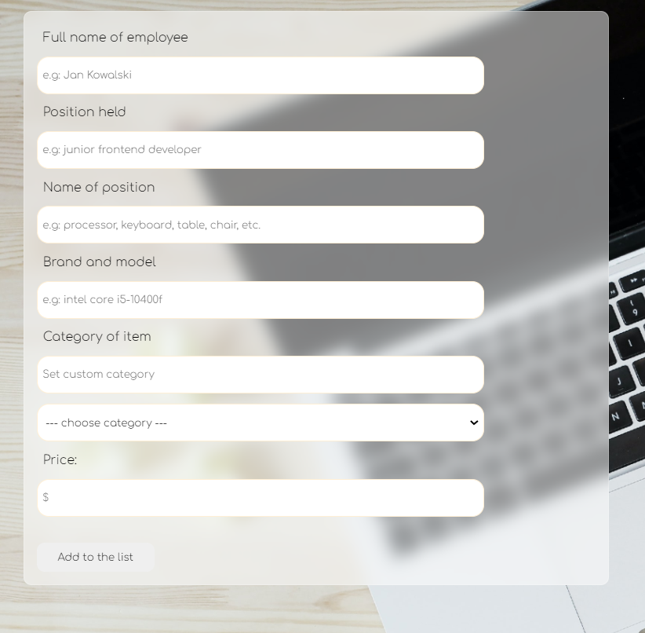
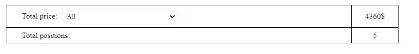
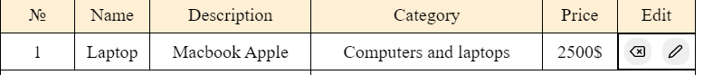
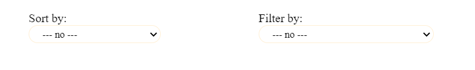
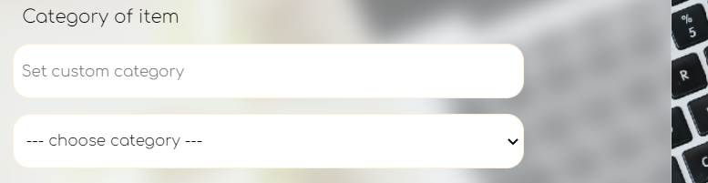
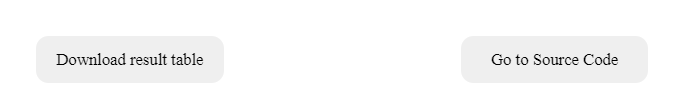

Test task for MDBootstrap:

### Zadanie rekrutacyjne:
* Zadanie polega na przygotowaniu aplikacji webowej. Sama aplikacja ma za zadanie pomóc podliczyć koszty nowego stanowiska komputerowego. 
* Po dodaniu każdej pozycji powinna ona wyświetlić się na liście w formie tabeli wraz z opcją usunięcia tej pozycji i podsumowanie łącznego kosztu i ilości pozycji.

    

Dodatkowę opcje zrobione :
* _Zapisywanie danych w localStorage, żeby nie znikały po odświeżeniu strony_

* _Podsumowanie kosztów i ilości pozycji dla poszczególnych kategorii_

* _Opcja edytowania dodanej pozycji_

* _Możliwość filtrowania po kategorii_
* _Możliwość sortowania po kategorii (cenie, nazwie produktu i opisie +  innych polach jeśli zdecydowałeś się je dodać)_

* _Możliwość dodania nowej kategorii_

* _Opcja drukowania listy lub exportu do pdf/csv/xml_

